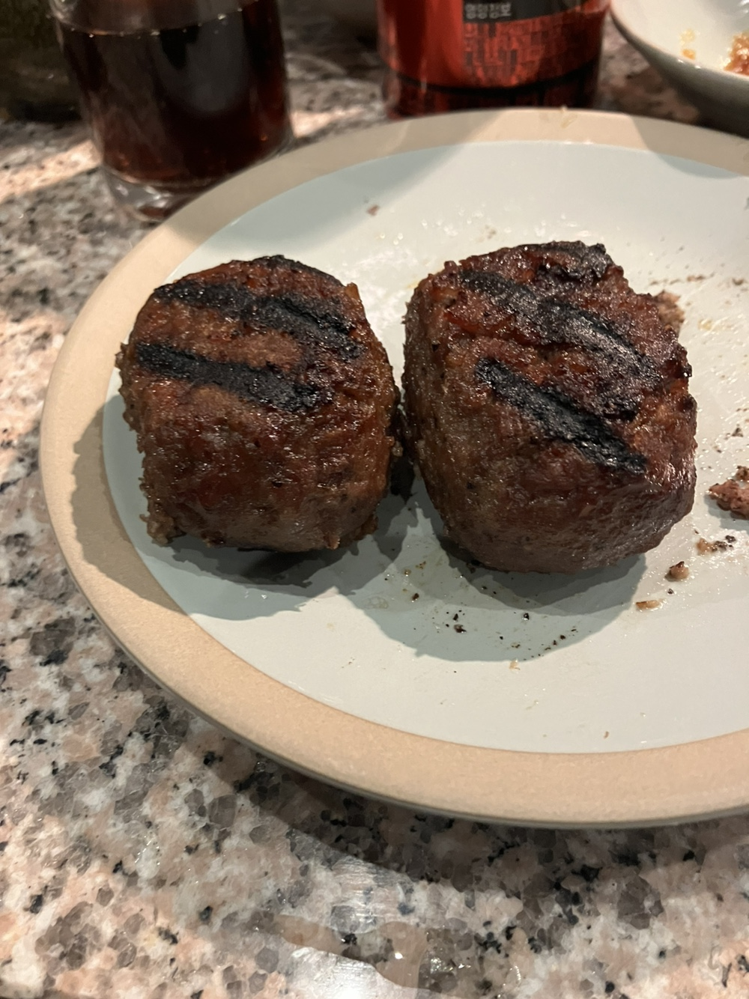
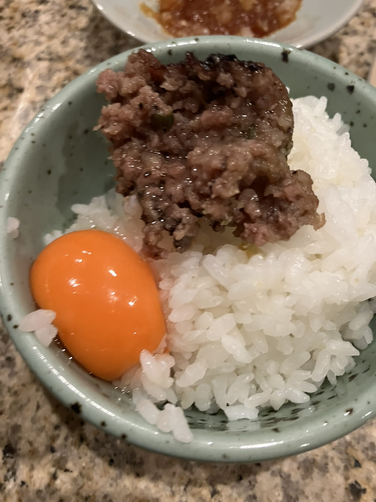
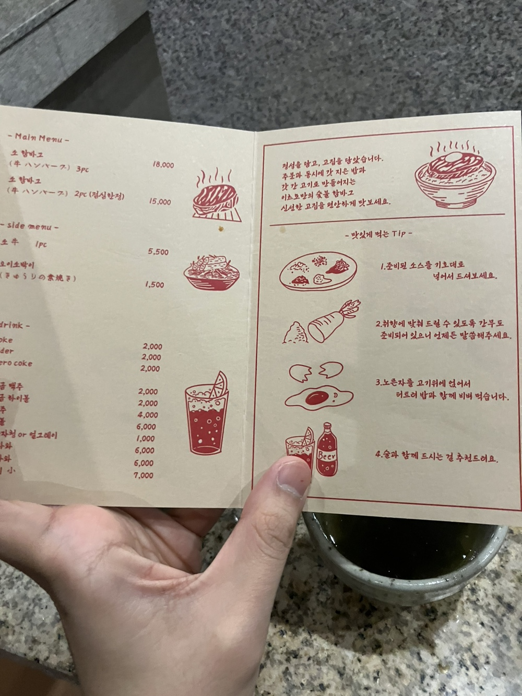
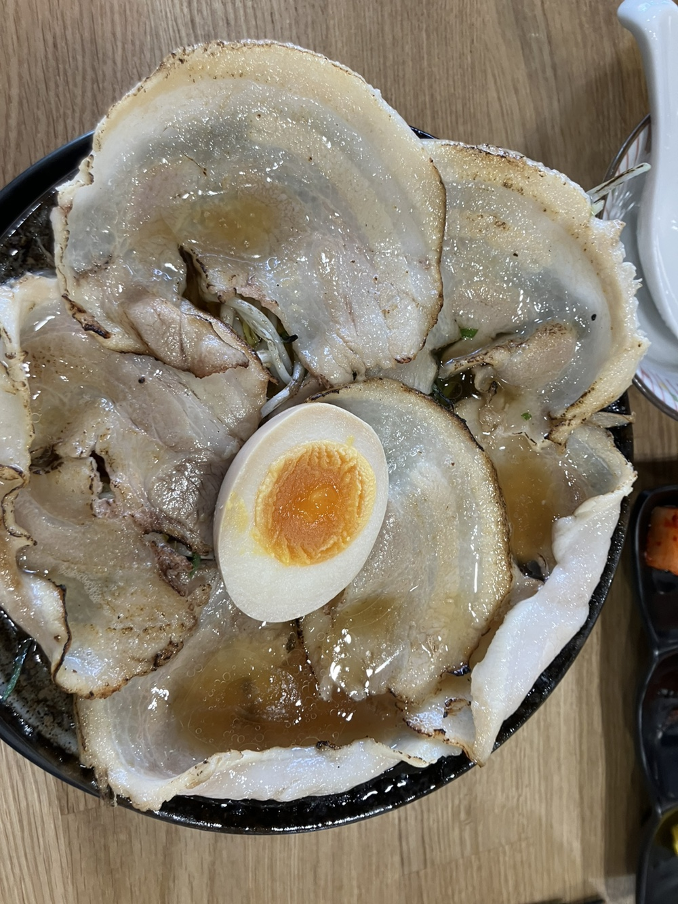
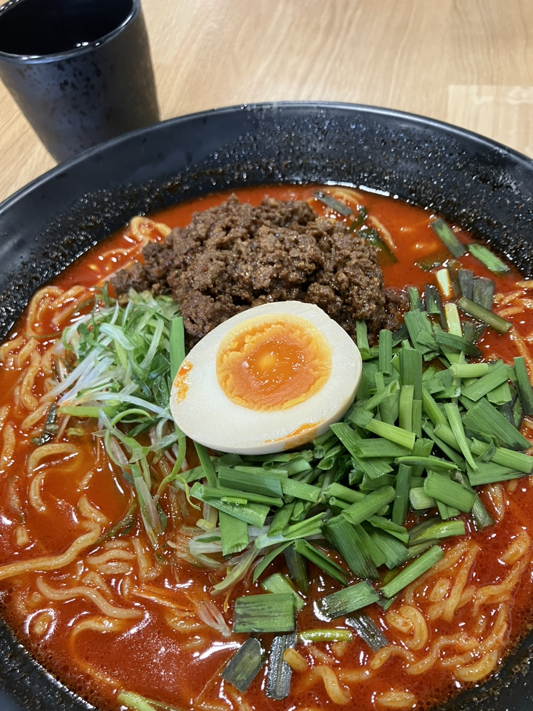
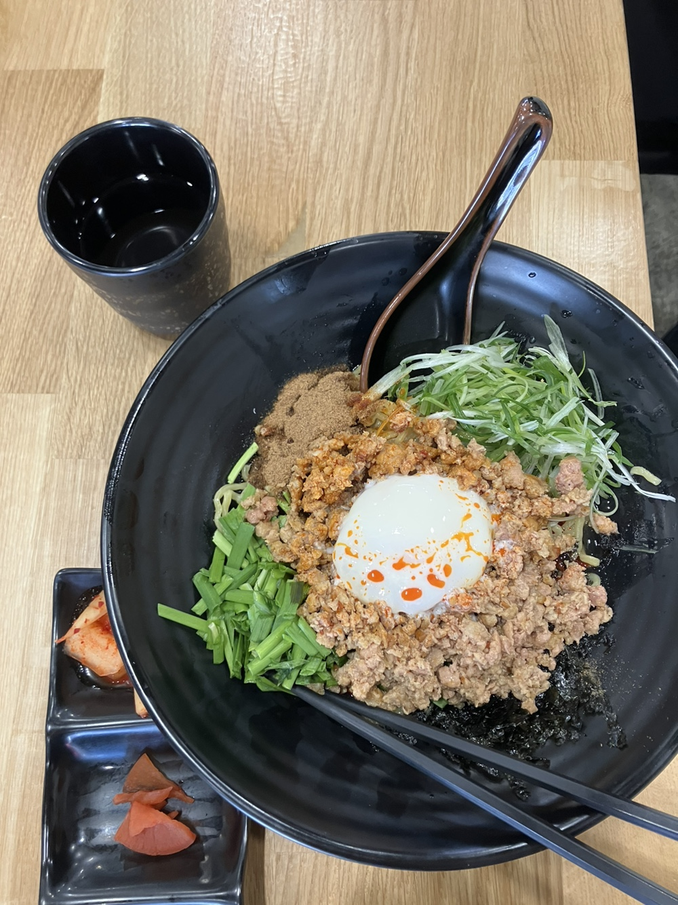
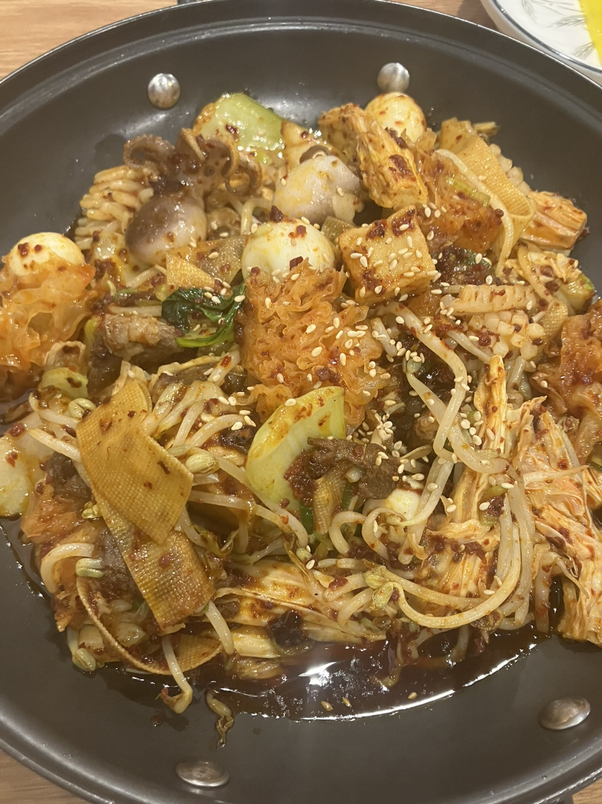
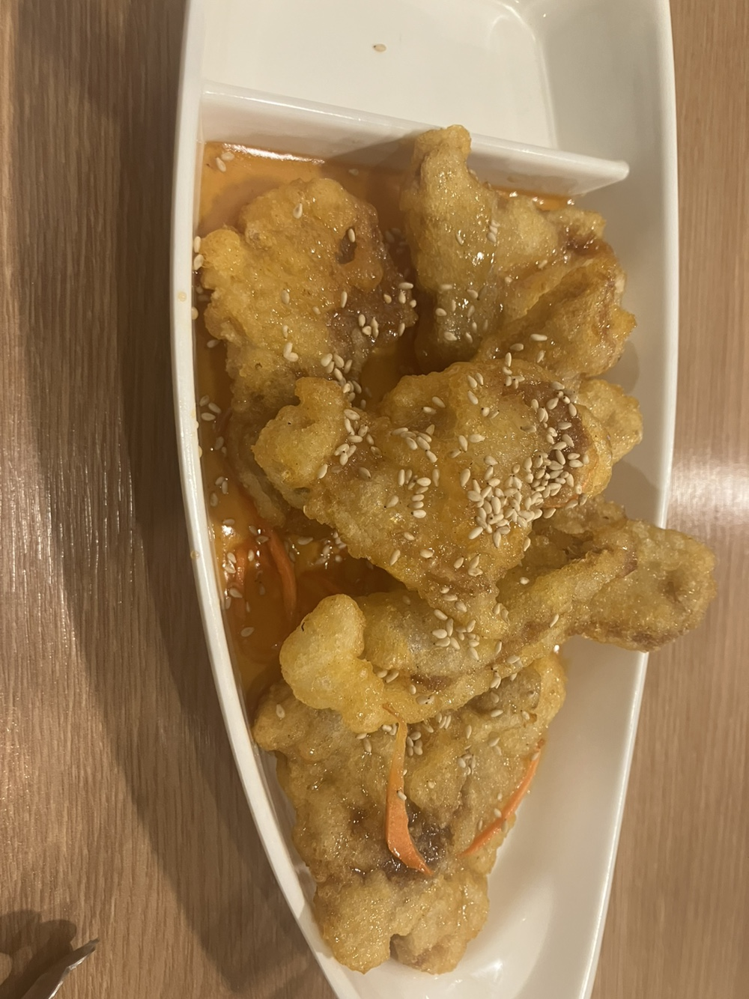
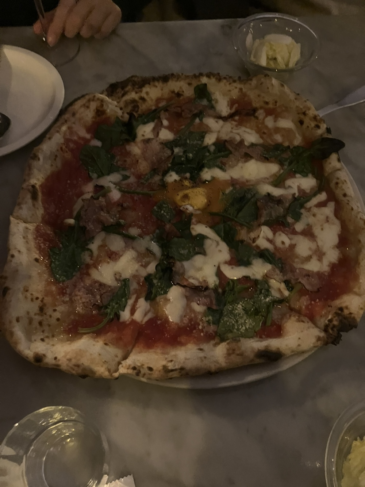
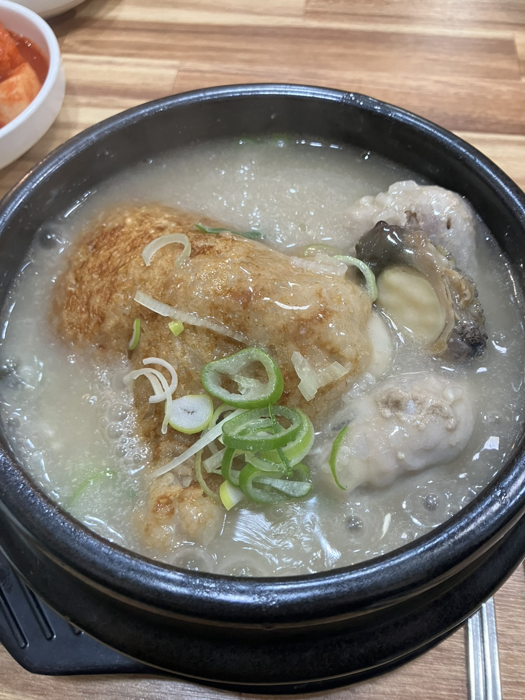

# 대전 맛집 블로그

#### 일식

  
<b>(★☆☆☆☆ 카이센동, 고등어봉초밥 )경성가-대전 유성구 대학로 77 1층 102호</b>

  

    <ul>
      <li> 밥이 상당히 질다. 회는 맛있지만, 회는 맛없기 어렵다. The rice is very tough. The sashimi is tasty, but it's hard for it to be not delicious. </li>
      
      
    </ul>
  

  
<b>(★★★☆☆ 우동, 교자 )요미우돈교자-대전 서구 둔산로31번길 35 1층</b>

  

    <ul>
      <li> 우동과 같이 나오는 소스 모두 맛이 보통이었다. 만두는 맛있었으나, 비비고 왕교자와 맛이 비슷하다. 만약 이 식당이 집과 가까우면 한두번 가겠지만, 그렇지 않다면 가지 않을 것이다. The taste of the udon and its sauce was average. The dumplings were good, but their taste was similar to Bibigo's large dumplings. If this restaurant were close to my home, I would go there occasionally; otherwise, I would not.</li>
      
      
      
    </ul>
  

  
<b>(★★★★☆ 함박스테이크 )이츠모-대전 서구 둔산로31번길 72 1층 101-1호</b>

  

    <ul>
      <li>한국에서 먹어본 함박중 맛있는 편이었다. 하지만  나는 함박 싫어한다.</li>
      
      
      
    </ul>
  

  
<b>(★★★☆☆ 라멘 )라멘우에무라-대전 유성구 관들2길 5</b>

  

    <ul>
      <li>평범한 탄탄멘, 마제소바, 그리고 라멘. 하지만 양은 많다.</li>
      
      
      
    </ul>
  

#### 중식

  
<b>(★★★★☆ 마라탕, 마라샹궈)청두-대전 유성구 문지로 319-17 1층</b>

  

    <ul>
      <li>마라샹궈하면 딱 떠오르는 그 맛. 한국에서 먹어본 마라샹궈중 3위 안에 든다. 나머지 메뉴들도 맛있어서 술먹으로 가면 좋을것 같다.</li>
      
      
    </ul>
  

#### 양식

  
<b>(★★★★★ 피자, 파스타)누오보나폴리-대전 유성구 농대로 15 신협3층</b>

  

    <ul>
      <li>-태어나서 먹은 음식중 가장 맛있었음. (하지만 주변 친구들중 많은 사람들이 짜다는 평가가 많았음. 참고바람). The food I've had here is the most delicious I've ever tasted in my life. However, it's worth noting that many of my friends found the dishes to be too salty. </li>
      
    </ul>
  

#### 한식

  
<b>(★★★★☆ 삼계탕, 왕갈비탕)형과아우누룽지삼계탕왕갈비탕-대전 유성구 대덕대로590번길 12-7 지상1층(도룡동)</b>

  

    <ul>
      <li> 삼계탕맛이 다 거기서 거기긴 한데, 실망스러운 삼계탕 맛은 아니다.</li>
      
    </ul>
  

  
<b>(★★★★☆ 따봉시레기, 왕갈비탕)형과아우누룽지삼계탕왕갈비탕-대전 유성구 대덕대로590번길 12-7 지상1층(도룡동)</b>

  

    <ul>
      <li> 삼계탕맛이 다 거기서 거기긴 한데, 실망스러운 삼계탕 맛은 아니다.</li>
      
    </ul>
  

#### KT 급식

  
<b>(★★★★☆ 삼계탕, 왕갈비탕)형과아우누룽지삼계탕왕갈비탕-대전 유성구 대덕대로590번길 12-7 지상1층(도룡동)</b>

  

    <ul>
      <li> -</li>
      
    </ul>
  

#### 디저트 & 카페

