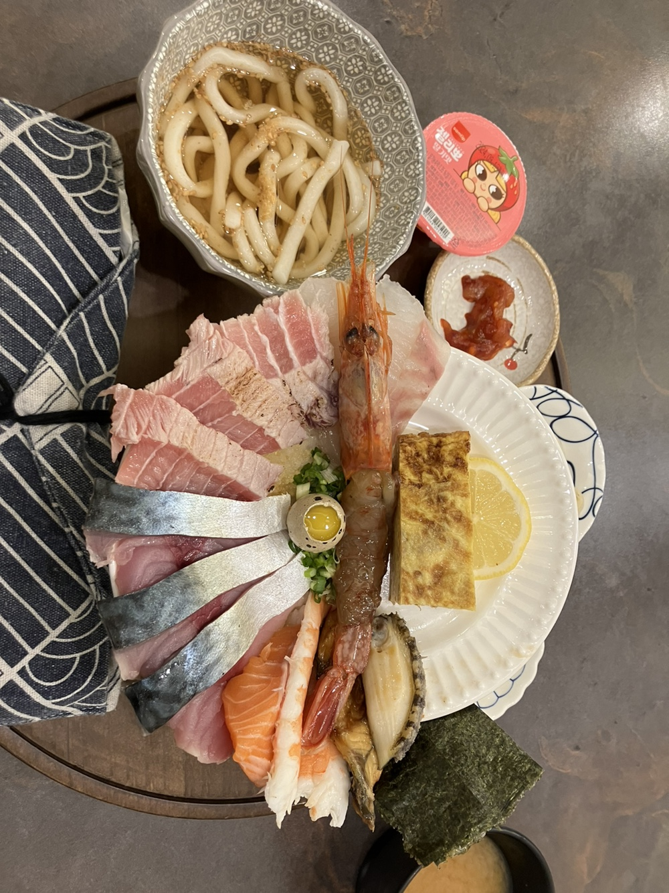
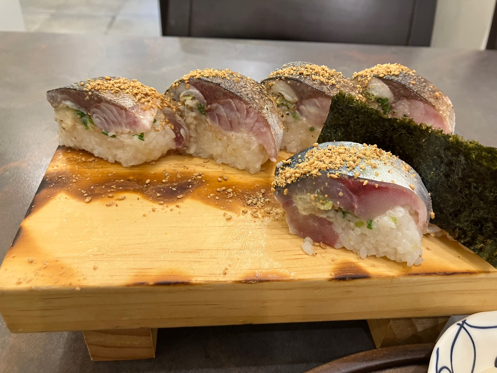
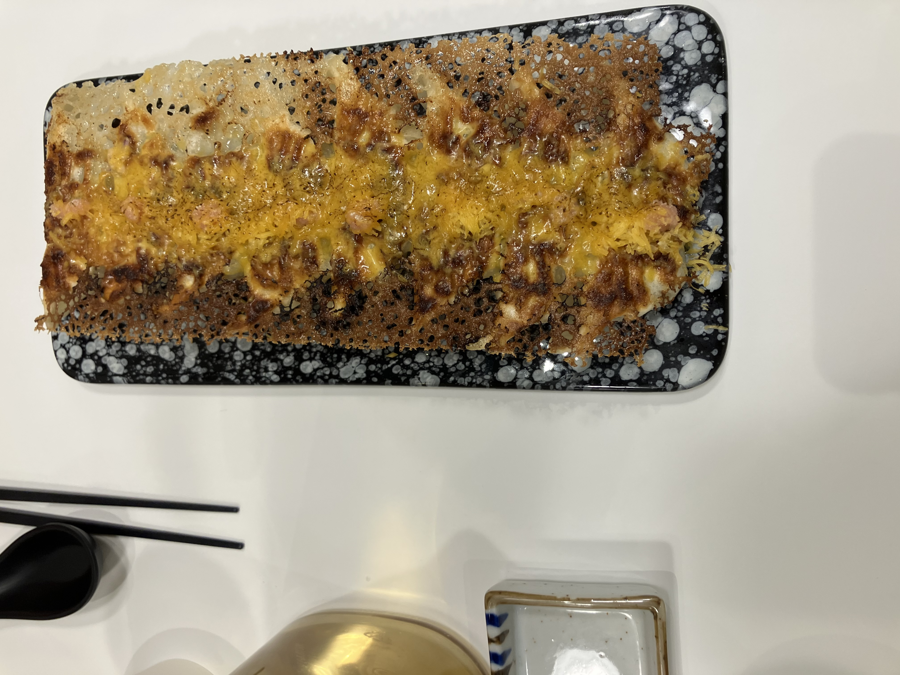

# 대전 맛집 블로그

#### 일식

  
<b>(★☆☆☆☆ 카이센동, 고등어봉초밥 )경성가-대전 유성구 대학로 77 1층 102호</b>

  

    <ul>
      <li> 밥이 상당히 질다. 회는 맛있지만, 회는 맛없기 어렵다. The rice is very tough. The sashimi is tasty, but it's hard for it to be not delicious. </li>
      
      
    </ul>
  

  
<b>(★★★☆☆ 우동, 교자 )요미우돈교자-대전 서구 둔산로31번길 35 1층</b>

  

    <ul>
      <li> 우동과 같이 나오는 소스 모두 맛이 보통이었다. 만두는 맛있었으나, 비비고 왕교자와 맛이 비슷하다. 만약 이 식당이 집과 가까우면 한두번 가겠지만, 그렇지 않다면 가지 않을 것이다. The taste of the udon and its sauce was average. The dumplings were good, but their taste was similar to Bibigo's large dumplings. If this restaurant were close to my home, I would go there occasionally; otherwise, I would not.</li>
      
      
      
    </ul>
  

